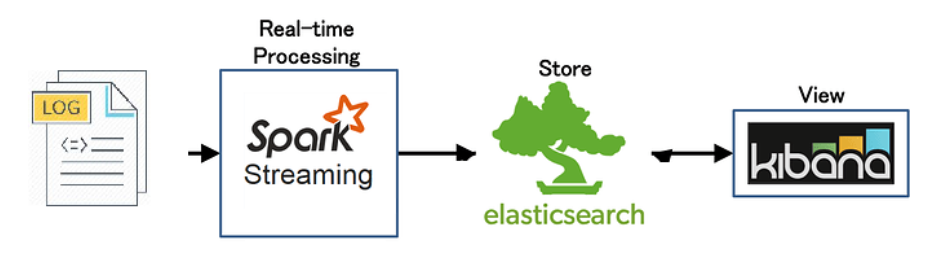

# Scala-Log-Generator-and-Analysis
## Steps :

1. Generate logs using log-generator.py file
2. Save each 10 logs in a separate file :
`
while :; do
  tail /tmp/log-generator.log > /home/dba/IdeaProjects/SparkStreamingPro/data/"$(date '+%s')".log;
  sleep 5;
done
`
The data of each file will be stored thereafter in data
frames composed of 5 columns: Protocol, Http, Url, Path and Ip thus constitute
the different batches to store in elasticsearch.

3. Get the output from Spark Streaming To ElasticSearch :

5. Create Dashboard on Kibana :

## Dependencies :
`
  "org.apache.spark" %% "spark-core" % "2.4.6",
  "org.apache.spark" %% "spark-sql" % "2.4.6",
  "org.apache.spark" %% "spark-mllib" % "2.4.6",
  "org.apache.spark" %% "spark-streaming" % "2.4.6" % "provided",
  "org.scala-sbt" %% "util-logging" % "1.6.0",
"org.elasticsearch" %% "elasticsearch-spark-20" % "7.16.2"
`
